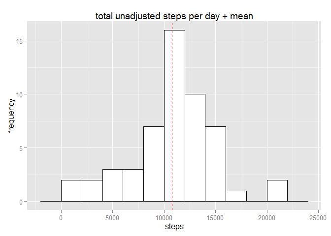
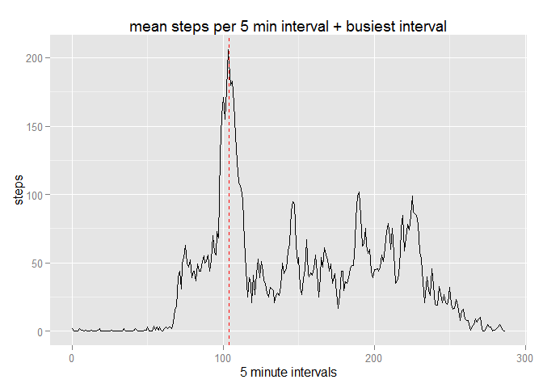
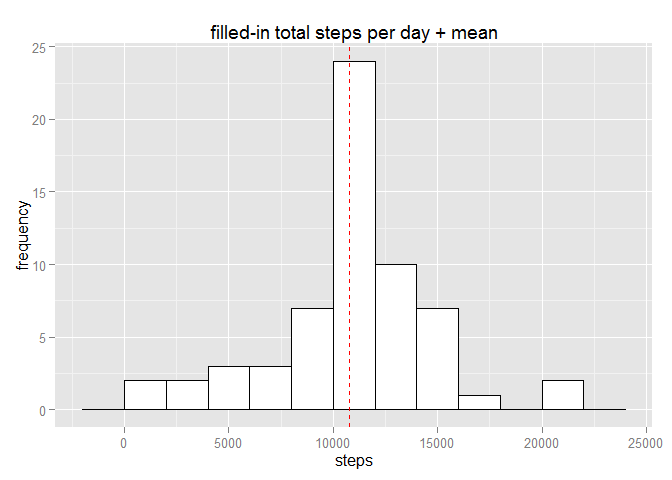
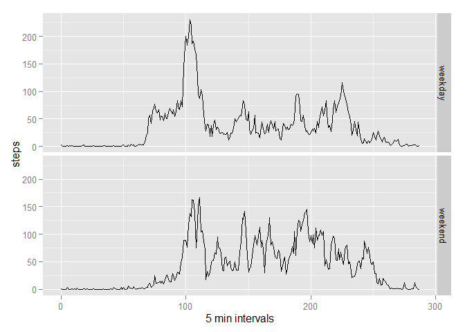

# chris rep research project 1. step counting
april 18 2015  
 

```r
# ..load & prepare data
act <- read.csv('activity.csv')
library(dplyr, warn.conflicts = FALSE, quietly = TRUE); library(ggplot2); 
```

```
## Warning: package 'dplyr' was built under R version 3.1.3
```

```r
day0 <- unclass(as.Date(act$date[1]))
act$day <- unclass(as.Date(act$date)) - day0
act$min <- floor(act$interval/100)*60 + act$interval%%100
act$weekday <- weekdays(as.Date(act$date))
```


```r
# ..imputing missing values
# ..going to fill NAs by getting mean of each 5min interval. 
actByInterval <- act %>% group_by(min) %>% 
	summarize(meanS=round(mean(steps, na.rm=TRUE)), 
		medS=median(steps, na.rm=TRUE))

nast <- is.na(act$steps)
# ..now can make new column with either actual, or mean, steps for each interval
act$stepFill <- ifelse(!nast, act$steps, actByInterval$meanS)

# ..summary of original grouped by date
actByDate <- act %>% group_by(date) %>% summarize(meanStep=mean(steps), 
	tStep=sum(steps), 
	tStepF=sum(stepFill), 
	day=mean(day)
  )
actByDate$weekday <- weekdays(as.Date(actByDate$date))
```

#### Calculate and report the mean and median of the total number of steps taken per day


```r
meanTstep <- mean(actByDate$tStep, na.rm=TRUE) 
medianTstep <- median(actByDate$tStep, na.rm=TRUE)
```

* mean steps per day = **10766.19**.
* median steps per day = **10765**.

#### Make a histogram of the total number of steps taken each day


```r
ggplot(actByDate, aes(x=tStep)) +
	geom_histogram(binwidth=2000, colour="black", fill="white") +
	geom_vline(aes(xintercept=meanTstep), colour="#FF0000", linetype="dashed", show_guide=TRUE) +
	ggtitle("total unadjusted steps per day + mean") +
	labs(x="steps", y="frequency")
```

 


#### Make a time series plot (i.e. type = 'l') of the 5-minute interval (x-axis) and the average number of steps taken, averaged across all days (y-axis)


```r
msi <- which(actByInterval$meanS==max(actByInterval$meanS))#
#msi <- as.integer(actByInterval[maxStepInterval, 1])
ggplot(actByInterval, aes(x=min/5, y=meanS)) + 
	geom_line() +
	#geom_hline(aes(yintercept=mean(meanS)), colour="#FF0000", linetype="dashed", show_guide=TRUE) +	
	geom_vline(aes(xintercept=msi), colour="#FF0000", linetype="dashed", show_guide=TRUE) +	
	ggtitle("mean steps per 5 min interval + busiest interval") +
	labs(x="5 minute intervals", y="steps")
```

 

```r
msiTime <- paste(floor(5*msi/60),':',(5*msi)%%60,' hrs',sep='')
```

#### Which 5-minute interval, on average across all the days in the dataset, contains the maximum number of steps?

* busiest interval is at interval **104**, which is **8:40 hrs**.


```r
# Imputing missing values
# ..see code chunk above
```

#### Calculate and report the total number of missing values in the dataset (i.e. the total number of rows with NAs)

* there is no data in **2304** rows of the original dataset.

#### Devise a strategy for filling in all of the missing values in the dataset.

* ..see above for implementation. imputed/original number is in stepFill column:


```r
head(act)
```

```
##   steps       date interval day min weekday stepFill
## 1    NA 2012-10-01        0   0   0  Monday        2
## 2    NA 2012-10-01        5   0   5  Monday        0
## 3    NA 2012-10-01       10   0  10  Monday        0
## 4    NA 2012-10-01       15   0  15  Monday        0
## 5    NA 2012-10-01       20   0  20  Monday        0
## 6    NA 2012-10-01       25   0  25  Monday        2
```

#### Make a histogram of the total number of steps taken each day

```r
meanTFstep <- mean(actByDate$tStepF, na.rm=TRUE)
medianTFstep <- median(actByDate$tStepF, na.rm=TRUE)
ggplot(actByDate, aes(x=tStepF)) +
	geom_histogram(binwidth=2000, colour="black", fill="white") +
	geom_vline(aes(xintercept=meanTFstep), colour="#FF0000", linetype="dashed") +
	ggtitle("filled-in total steps per day + mean") +
	labs(x="steps", y="frequency")
```

 

#### Calculate and report the mean and median total number of steps taken per day. 

* mean (with imputed values) steps per day = **10765.64**.
* median (with imputed values) steps per day = **10762**.

#### What is the impact of imputing missing data on the estimates of the total daily number of steps?

* The means pre- and post-impute are the same. The small difference is due to rounding the imputed value. It's the same because we added as many counts to the data as we added means, so no net effect.

* The imputed median is very slightly lower. Another rounding effect. 

#### Weekdays / Weekends


```r
# Create a new factor variable - "weekday" and "weekend" 
weekend <- act$weekday %in% c('Saturday', 'Sunday')
act$weekend <- ifelse(weekend, 'weekend', 'weekday')
```

#### Make a panel plot containing a time series plot of the 5-minute interval (x-axis) and the average number of steps taken, averaged across all weekday days or weekend days (y-axis).

```r
actByWeekend <- act %>% group_by(min, weekend) %>% summarize(meanStep=mean(stepFill))

meanE <- mean(actByWeekend[actByWeekend$weekend=='weekend', ]$meanStep)
meanD <- mean(actByWeekend[actByWeekend$weekend=='weekday', ]$meanStep)
ggplot(actByWeekend, aes(x=min/5, y=meanStep)) +
  geom_line() + facet_grid(weekend ~ .) +
  labs(x="5 min intervals", y="steps")
```

 

#### Are there differences in activity patterns between weekdays and weekends?

Average steps per interval at the weekend is **42**, which is higher than the **36** average on weekdays. But peak steps is higher on weekday mornings. 


